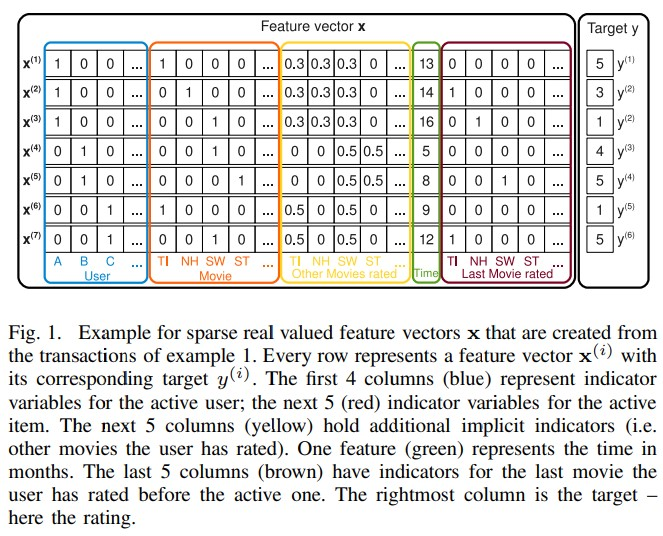
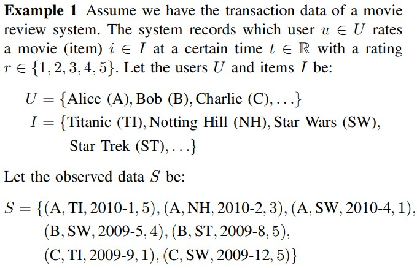
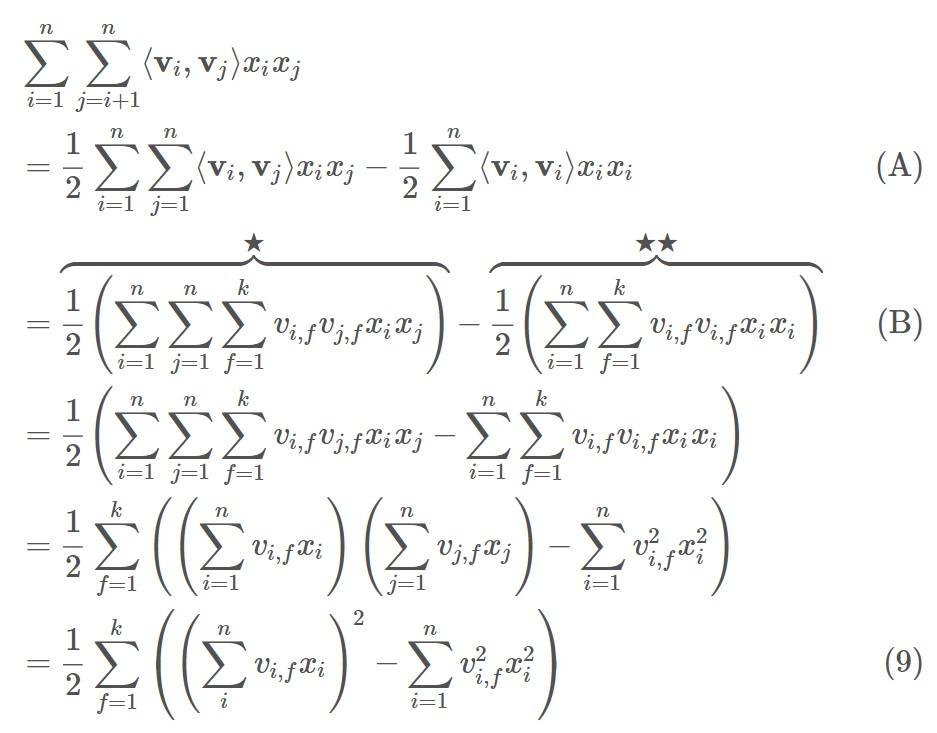
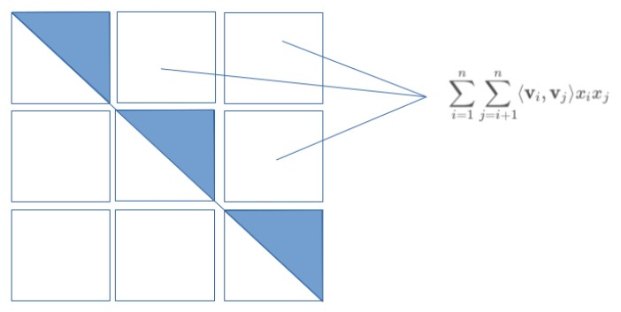
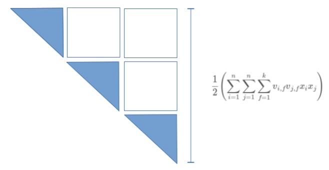
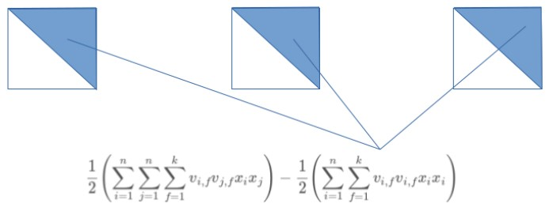

## 개요
> 추천시스템에서 사용되는 개념 중 하나인 Factorization Machine에 대한 소개 및 간략한 pytorch model 소개, python에서 FM을 구현한 LightFM 패키지의 사용법 정리

## 1. References

### Factorization Machine

#### Related Paper

https://www.csie.ntu.edu.tw/~b97053/paper/Rendle2010FM.pdf

#### Detail Description of FM

https://www.jefkine.com/recsys/2017/03/27/factorization-machines/

#### Etc References

https://yamalab.tistory.com/107

https://yamalab.tistory.com/128?category=747907

https://greeksharifa.github.io/machine_learning/2019/12/21/FM/


### LightFM by lyst

#### github repository

https://github.com/lyst/lightfm

#### Implementation References

<a href="https://www.kaggle.com/niyamatalmass/lightfm-hybrid-recommendation-system">LightFM Hybrid Recommendation system</a>

<a href="https://towardsdatascience.com/how-i-would-explain-building-lightfm-hybrid-recommenders-to-a-5-year-old-b6ee18571309">How I would explain building “LightFM Hybrid Recommenders” to a 5-year old!</a>

#### Etc References

[Learning to Rank Sketchfab Models with LightFM](http://blog.ethanrosenthal.com/2016/11/07/implicit-mf-part-2/)

[Metadata Embeddings for User and Item Cold-start Recommendations](http://building-babylon.net/2016/01/26/metadata-embeddings-for-user-and-item-cold-start-recommendations/)

[Recommendation Systems - Learn Python for Data Science](https://www.youtube.com/watch?v=9gBC9R-msAk)

[Using LightFM to Recommend Projects to Consultants](https://medium.com/product-at-catalant-technologies/using-lightfm-to-recommend-projects-to-consultants-44084df7321c#.gu887ky51)


## 2. Factorization Machine

### 2.1. Introduction

 FM(Factorization Machine)은 SVM과 같은 예측모델이지만 높은 희소행렬 환경에서도 신뢰할 만한 추정이 이루어지는 모델이다. FM은 선형적인 시간복잡도로 수행이 되며, 이로 인해 직접적인 최적화 및 모델 파라미터 저장 시 SVM과 달리 그에 수반되는 데이터를 저장할 필요가 없다. 


FM의 장점

1. SVM이 실패하는 엄청 희소한 데이터에 대해서도 parameter 추정이 가능
2. 선형적인 복잡성으로 support vector들에 의존이 필요없이 최적화 수행이 가능하고, 엄청난 양이 데이터셋에도 훈련이 가능하다.
3. 어떤 실제 값을 가진 feature vector에도 예측을 수행할 수 있다.


### 2.2. Prediction under Sparsity

목표는 $y: R^n \rightarrow T$를 충족하는 function을 추정 $x\in{R^n}; T:Target\ Domain(classification\ or\ regression)$

Training Dataset: $D = {(x^{(1)},y^{(1)}),(x^{(2)},y^{(2)}),...}$

function을 통해 도출한 점수 값을 정렬함으로써  ranking task에도 사용할 수 있다.

scoring function은 $(X^{(A)},X^{(B)})\in{D}$ 에서, $X^{(A)}$는 $X^{(B)}$보다 높은 rank에 있다는 것을 가정해서 pairwise training data<a href="https://www.cs.cornell.edu/people/tj/publications/joachims_02c.pdf">[5]</a> 를 통해 학습할 수 있다.  pairwise ranking relation은 비정상적이라 positive training instance 만을 대상으로 수행한다.

<div align="center">

</div>


<div align="center">

</div>


위의 그림은 논문에서 다루게되는 데이터를 나타낸 도식이다. 앞서 설명한 것과 같이 데이터는 high sparsity한 형태를 가지고 있다. 그리고 논문에서 언급하는 Example 1에서 나타나는 데이터는 Fig1.에서 하나의 row마다 표현되어 있다.


### 2.3. Factorization Machines (FM)

#### A. Factorization Machine Model

1. Model Equation

   factorization machine에서 사용하려는 feature의 degree, d=2인 경우의 식은 아래와 같다.

   $\hat{y}(x):=w_0+\overset{n}{\underset{i=1}{\sum}}w_ix_i+\overset{n}{\underset{i=1}{\sum}}\overset{n}{\underset{j=i+1}{\sum}}<v_i,v_j>x_ix_j$

   $w_0\in{R},\ w\in{R^n},\ V\in{R^{n\times{k}}}$

   $<*,*>$ 는 k크기의 두벡터를 내적한 것과 같다.

   $<v_i,v_j>:=\overset{k}{\underset{f=i}{\sum}}v_{i,f}*v_{j,f}$

   V벡터 내에서 $v_i$는 k개의 factor로 나타낸 i번째 변수를 말한다.

   $k\in{N_0^+}$는 factorization을 수행할 차원을 정의하는 hyper parameter를 말한다.

   * $w_0$는 global bias

   * $w_i$는 i 번째 변수의 strength
   * $\hat{w}_{i,j}:=<V_i,V_j>$ i번째 변수와 j번째 변수의 상관관계를 모델링한다.

2. Expressiveness

   positive definite matrix $W$, k값이 충분히 크게되면 우측의 식을 만족하고 어떤 FM이건 interaction Matrix $W$를 나타낼 수 있다. $W=V*V^t$ . 그럼에도 불구하고, 복잡한 interaction W를 추정하기에 적절한 데이터가 없어 k를 작은 값으로 설정한다. 그리고 k를 제한하는 것은 FM의 비용때문이며 이는 일반성을 높여준다.

3. Parameter Estimation Under Sparsity

   FM은 feature간의 상호관계를 잘 추정할 수 있다. 왜냐하면, factorizing 함으로써 독립성을 허물기 때문이다. 

   e.g) Alice와 Star Trek 간의 interaction

4. Computation

   직관적인 시간복잡도는 $O(Kn^2)$. 왜냐하면, 모든 pairwise interaction이 계산되어야 하기 때문이다. 그러나 식을 재구축하게 되면 linear한 시간복잡도를 얻을 수 있다.

   $\hat{y}(x):=w_0+\overset{n}{\underset{i=1}{\sum}}w_ix_i+\overset{n}{\underset{i=1}{\sum}}\overset{n}{\underset{j=i+1}{\sum}}<v_i,v_j>x_ix_j$

   $<v_i,v_j>:=\overset{k}{\underset{f=i}{\sum}}v_{i,f}*v_{j,f}$

   <div align="center">
   
   </div>


   positive semi-definite matrix $W=VV^T$는 대칭적인 pairwise feature interaction의 가중치를 가지고 있다. 대칭성(divided by 2) 때문에 다른 모든 pair들을 더하는 것은 모든 pair를 더하는 것에 자기자신을 더한것을 빼는 것과 동일하다. 따라서 A의 수식이 등장.

   

   * **linear equation Figure1.**

   <div align="center">
   
   </div>


   * **linear equation Figure2.**

   <div align="center">
   
   </div>


   * **linear equation Figure3.**

   <div align="center">
   
   </div>


   위의 절차를 통해 각 feature들 간의 interaction만을 담은 9번식을 가지고 아래의 전체 식이 도출된다.

   $\hat{y}(x)=w_0+\overset{n}{\underset{i=1}{\sum}}w_ix_i+\frac{1}{2}\overset{k}{\underset{f=1}{\sum}}((\overset{n}{\underset{i}{\sum}}v_{i,j}x_i)^2-\overset{n}{\underset{i=1}{\sum}}v^2_{i,f}x^2_i)$

   그리고 x의 대부분의 인자값은 0이라서 non-zero element들에 대해서만 sum이 일어남으로 시간복잡도는 $O(k\bar{m}_D)$라고도 추정할 수 있다.

5. Summary

   FM 모델은 feature vector의 값과 factorized interaction 값을 활용하여 모든 가능한 interaction들을 표현한다. 이는 두가지 이점이 있다.

   1) 더 큰 sparsity한 특징을 가진 상관관계도 나타낼 수 있다. 특히 관측되지 않은 상관관계에 대해 일반화가 가능하다.

   2) 파라미터의 수나 시간이 선형적인 복잡도를 가진다. 이 때문에 최적화시 SGD를 사용할 수 있으며, 다양한 loss function을 채택할 수 있다.


## 3. LightFM implementation

 FM에 대해 간략한 소개가 끝났다면, 이를 기본적인 user/item간의 상관관계 값 말고도 각 element들의 context data를 반영하여 학습할 수 있도록 구현한 LightFM 패키지의 사용법에 대해 알아보자.

전체 실행에 대한 파일은 아래의 링크의 ipynb 파일을 참고하자.

### 3.1. installation package

```python
!pip install lightfm
```

### 3.2. Data Preparation for LightFM

#### 3.2.1. Define Dataset

LightFM 패키지를 사용하기 위해서는 학습에 사용할 데이터를 데이터셋으로 변환시켜주어야 한다.

dataset.fit()시에는,

* 예측해야 하는 user/item_id의 범위 (from 0)
* user/item feature 매핑시 사용될 user/item feature의 컬럼명

위의 두가지에 대해 각각하여 4가지 파라미터를 입력하여 넘긴다.

만약, user/item feature가 없는 경우에는 위의 2개만 넘기면, feature들은 None이 된다. 그리고, 만약 하나만 있는 경우라면 있는 것에 대해서만 넘겨준다.

```python
from lightfm.data import Dataset

dataset = Dataset()

user_ids = [i for i in range(ratings.userId.max()+1)]
movie_ids = [i for i in range(movies.movieId.max()+1)]

dataset.fit(
    user_ids,
    movie_ids,
    item_features = list_if
)
```

#### 3.2.2 Define Interaction and User/Item Features

데이터셋 fit시 선언한 값들에 대해 실제 값들을 input하는 과정

```python
interactions, weights = dataset.build_interactions(ratings["user_movie_rating"])

item_features = dataset.build_item_features(item_tuple, normalize=False)
```

User/Item feature를 넣지 않는 경우, Interaction만 정의하고, Feature값은 생략한다.

Interaction, weight 정의를 위해서 (user_id,item_id,weight) 순의 tuple로 build_interactions function으로 넘겨주면, interaction을 반영한 (len(user_ids), len(movie_ids)) 형태의 sparse matrix를 return한다.

User/Item Feature의 경우, (item id, [list of feature names]) 또는 (item id, {feature name: feature weight})의 형태로 tuple을 정의하여 넘겨준다. 이에 대한 상세한 예시는 아래의 링크를 참고한다.

### 3.3. Train LightFM

아래의 코드를 참고하여 validation 여부를 반영한 LightFM 모델의 Training을 수행한다.

```python
from lightfm import cross_validation
from lightfm import LightFM

class TrainLightFM:
  def __init__(self):
    pass

  def train_test_split(self, interactions, weights, random_state=101):
    train_interactions, test_interactions = cross_validation.random_train_test_split(interactions, random_state=np.random.RandomState(101))
    train_weights, test_weights = cross_validation.random_train_test_split(weights, random_state=np.random.RandomState(101))
    
    return train_interactions, test_interactions, train_weights, test_weights

  def fit(self, interactions, weights, user_features, item_features, cross_validation=False, no_components=150, learning_rate=0.05, loss="warp", random_state=101, verbose=True, num_threads=4, epochs=5):
    model = LightFM(no_components, learning_rate, loss=loss, random_state=random_state)

    if cross_validation:
      train_interactions, test_interactions, train_weights, test_weights = self.train_test_split(interactions, weights, random_state)
      model.fit(train_interactions, user_features=user_features, item_features=item_features, sample_weight=train_weights,epochs=epochs, num_threads=num_threads, verbose=verbose)

      return model, train_interactions, test_interactions, train_weights, test_weights

    else:
      model.fit(interactions, item_features=item_features, user_features=user_features, sample_weight=weights, epochs=epochs, num_threads=num_threads, verbose=verbose)

      return model
```

```python
lightFM_trainer = TrainLightFM()

val_model, train_interactions, test_interactions, train_weights, test_weights = lightFM_trainer.fit(interactions, weights, user_features=None, item_features=item_features, cross_validation=True, no_components=150, learning_rate=0.05, loss="warp", random_state=101, verbose=True, num_threads=4, epochs=100)
```

### 3.4. Make a Recommendation using LightFM

#### 3.4.1. Result Validation

```python
### epoch 100
%%time
train_auc_score = calculate_auc_score(val_model, train_interactions, item_features, None)

### epoch 100
%%time
valid_auc_score =  calculate_auc_score(val_model, test_interactions, item_features, None)

### epoch 100
%%time
train_pre_k_score =  precision_at_k(val_model,train_interactions,item_features=item_features).mean()

### epoch 100
%%time
valid_pre_k_score = precision_at_k(val_model,test_interactions, train_interactions,item_features=item_features).mean()
```

#### 3.4.2. Make a Recommendation

```python
class LightFMRecommendations:
  def __init__(self, lightfm_model,  user_features, item_features, movies, ratings):
    self.model = lightfm_model
    self.user_features = user_features
    self.item_features = item_features
    self.movies = movies
    self.ratings = ratings

  def previous_rated_movies(self, user_id):
    previous_rated_movies = self.ratings.loc[self.ratings["userId"] == user_id]
    
    return previous_rated_movies

  def _filter_item_by_user(self, user_id, filter_previous=False):
    if filter_previous:
      previous_rated_movies = self.previous_rated_movies(user_id)
      list_prev_rated_movieIds = previous_rated_movies["movieId"].values.tolist()
      movies_for_prediction = self.movies.loc[~self.movies["movieId"].isin(list_prev_rated_movieIds)]
    else:
      movies_for_prediction = self.movies

    return movies_for_prediction

  def recommend_by_user_id(self, user_id, filter_previous=False, num_prediction=10):
    movies_for_prediction = self._filter_item_by_user(user_id,filter_previous)
    score = self.model.predict(
        user_id,
        movies_for_prediction["movieId"].values.tolist(),
        item_features=self.item_features
        # user_features=self.user_features
    )

    movies_for_prediction["recommendation_score"] = score
    movies_for_prediction = movies_for_prediction.sort_values(by="recommendation_score",ascending=False)[:num_prediction]

    return movies_for_prediction
```

```python
lightFM_recommender = LightFMRecommendations(val_model,None,item_features,movies,ratings)
movies_for_prediction_F = lightFM_recommender.recommend_by_user_id(user_id=0,filter_previous=False,num_prediction=10)
movies_for_prediction_T = lightFM_recommender.recommend_by_user_id(0,True,10)
```


