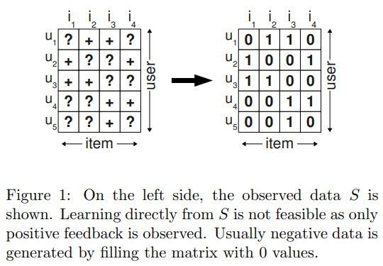
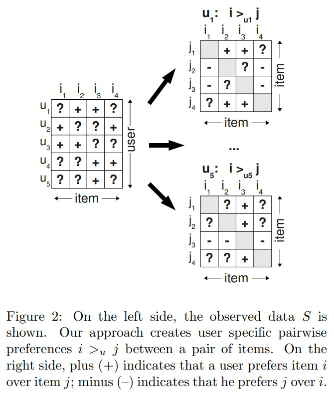
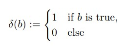
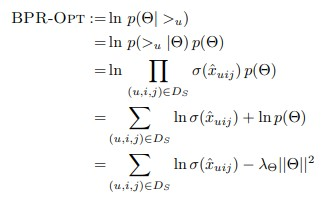
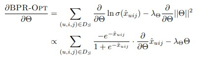
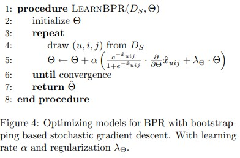
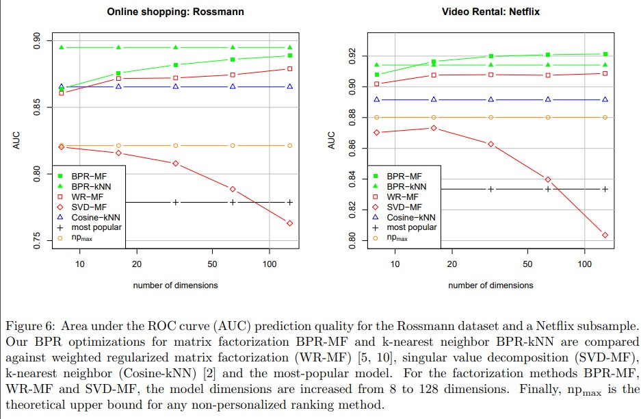

## 개요
> BPR: Bayesian Personalized Ranking for Implicit Feedback 논문 리뷰

## paper

<a href="https://arxiv.org/ftp/arxiv/papers/1205/1205.2618.pdf">https://arxiv.org/ftp/arxiv/papers/1205/1205.2618.pdf</a>

## reference
<a href="https://leehyejin91.github.io/post-bpr/">https://leehyejin91.github.io/post-bpr/</a>

## code
<a href="https://github.com/RunlongYu/BPR_MPR">https://github.com/RunlongYu/BPR_MPR</a>

<a href="https://github.com/sh0416/bpr">https://github.com/sh0416/bpr</a>

## Abstract
Item Recommendation에서 중요한 단계 중에 하나는 추천할 아이템을 어떤 순서대로 정렬하여 반환하는지를 결정하는 것이다. 해당 paper에서 추천에 사용할 feedback은 implicit하며, 이를 당시 item recommendation에 자주 쓰인 Matrix Factorization이나, Adaptive k-nearest neighbor 알고리즘을 통해 구현한다. 해당 방식이 제안되기 전에는 ranking을 직접적으로 optimization 하는 사례는 없었다.

이 논문을 통해 Bayesian analysis를 통해 도출한 posterior estimator를 최대화하여 최적화하는 BPR-OPT를 제안한다. 학습시에 복원추출을 반영한 SGD를 사용한다.

결과적으로 가장 많이 사용되는 두 접근법에 BPR-OPT를 적용하고 다른 기존의 방법에 비해 월등한 성능을 보였다.

## 1. Introduction
해당 논문을 통해 기여하는 점은 아래와 같다.

1. optimal personalized ranking을 추정하기 위해 BPR-OPT 최적화 방식을 제안한다.
2. BPR-OPT를 최대화하는데 있어서 복원추출 및 SGD를 반영한 LEARBPR 알고리즘을 제안하며, 이는 기존으 full gradient descent보다 좋은 성능을 보였다.
3. 어떻게 MF와 adapted K-nn에 이를 반영하는지 살펴본다.
4. 경험적인 결과로 다른 방법보다 얼마나 성능이 좋은지 평가한다.

## 3. Personalized Ranking

### 3.1. Formalization

Item Recommendation을 수행해야하는 Dataset에 대해 아래와 같은 정의를 하자.

* U: 모든 user에 대한 user set
* I: 모든 item에 대한 item set

    이는 와 같이 나타낼 수 있다. 

Recommender의 목적은 특정 사용자에 대해 personalized total ranking인 )를 예측하는 것이다.

이는 아래의 성질을 가진다.

*   totality

*  antisymmetry

*  transitivity

마지막으로, positive한 반응을 보인 값들에 대해 아래의 기호로 표현한다.

특정 사용자 u가 positive하기 interaction한 Item의 집합

특정 아이템 i가 positive하기 interaction된 User의 집합

### 3.2. Analysis of the problem setting

보통의 일반적인 Item Recommendation Approach는 Implicit dataset에 대해 상호작용한 값에 대해서는 1을, 나머지 상호작용하지 않았거나 missing value에 대해서는 0값을 대입하여 학습을 수행한다. 이를 통해 특정 user가 item에 상호작용하는 점수인 를 구하고 정렬한 후 상위 K개의 item을 return하여 Recommendation을 수행한다. 

그러나 이 접근법의 문제는, Item을 추천하는데 있어 positive interaction을 하지 않은 Item에 대해서도 추천을 수행해야 하지만, 이들에 대해서는 예측을 수행할 수 없다는 점이다. 

따라서 해당 논문에서 접근하는 item pair를 사용하는 논점을 적용해보자. 이를 적용함으로써 위의 방식보다 item에 대한 ranking을 더 잘 나타낼 수 있게 된다. 

\in{S})에 대해 관측된 item은 그렇지 않은 item에 비해 선호된다고 말할 수 있다. 그래서 user1에 대해 item 1과 2를 살펴보면, item 2는 관측되었기 때문에 2는 1보다 선호되는 아이템이라고 볼 수 있다. 그래서 item 1의 관점에서 2와 비교하면 비선호한다고 우측그림과 같이 나타낼 수 있다.

이를 반영하여 수식화하면,

특정 사용자 u는 i를 선호하고 j를 비선호하는 경우에 대해서 위의 수식으로 표현할 수 있다.

이로 인한 장점은,

1. Traning Dataset이 긍정/부정/missing value에 대한 학습을 할 수 있도록 한다. 그리고 Missing value가 추후 ranking 시스템에서 나타나야 하는 item임을 인지한다. 이는 반영한 데이터셋이 pairwise한 점을 반영하고, test해야 할 missing값이 train값과 서로소임을 알 수 있다.

2. 학습할 데이터가 ranking 산정을 위한 목표를 위해 재구성된 것이다.

## 4. Bayesian Personalized Ranking

personalized ranking을 학습하기 위해 , likelihood function)과 사전확률)을 사용하는 Bayesian Analysis 방법을 활용한 최적화인 BPR-OPT 최적화를 수행한다.

### 4.1. BPR Optimization Criterion

_{u})\propto{p(>_u|\Theta)p(\Theta)}" title="p(\Theta|>_{u})\propto{p(>_u|\Theta)p(\Theta)}"/>

personalized ranking 예측을 위한 Bayesian method의 수식은 위와 같으며, 이를 최대화 하기 위해서는 선후확률을 최대화하는 방식으로 학습을 수행한다.

#### **likelihood 계산** 

_u|\Theta)=\underset{(u,i,j)\in{U}\times{I}\times{I}}{\prod}p(i>_u{j}|\Theta)^{\delta((u,i,j)\in{D_S})} * (1-p(i>_u{j}|\Theta)^{\delta((u,i,j)\notin{D_S})})" title="\underset{u\in{U}}{\prod}p(>_u|\Theta)=\underset{(u,i,j)\in{U}\times{I}\times{I}}{\prod}p(i>_u{j}|\Theta)^{\delta((u,i,j)\in{D_S})} * (1-p(i>_u{j}|\Theta)^{\delta((u,i,j)\notin{D_S})})"/>

likelihood(가능도)는 위의 수식으로 나타낼 수 있다.

그리고, 앞서 살펴본 totality와 antisymmetry 성질에 의해 위의 식을 아래와 같이 간단히 만들 수 있다.

_u|\Theta)=\underset{(u,i,j)\in{D_S}}{\prod}p(i>_u{j}|\Theta)" title="\underset{u\in{U}}{\prod}p(>_u|\Theta)=\underset{(u,i,j)\in{D_S}}{\prod}p(i>_u{j}|\Theta)"/>

personalized total order를 보장해주기 위해서는 위의 3가지 성질이 충족되어야 하며, 이것 때문에 사용자 u가 i를 j보다 더 선호할 확률을 아래와 같이 나타낼 수 있다.

_u{j}|\Theta):=\sigma(\hat{x}_{uij}(\Theta))" title="p(i>_u{j}|\Theta):=\sigma(\hat{x}_{uij}(\Theta))"/>

)는 MF나 adapted k-nn으로 계산한 값이다.

#### **사후확률 계산**

BPR-OPT를 계산을 위한 사후확률분포는 평균이 0이고 분산이  Matrix를 따른다.

모르는 파라미터의 표현을 줄이기 위해 로 표현한다. 이렇게 표현하면 아래와 같이 BPR-OPT를 위한 식은 아래와 같이 표현된다.

### 4.2. BPR Learning Algorithm

우리가 최적화할 BPR-OPT를 학습하기 위해서는 gradient descent 방식을 활용한다. 그러나 기본적인 gradient descent 방식은 옳지 못하여 LearnBPR를 수행하는데 있어서 stochastic gradient-descent 방식을 활용하도록 한다.

 
 

위와 같이 full gradient descent를 실행하면 아래와 같은 문제가 생긴다.

* 관측된 i집단과, 관측되지 않은 j집단의 비대칭성 문제.

    : 수렴 속도 저하 및 잘못된 수렴 결과 초래

    일반적으로, i집단이 j집단보다 개수가 작아 optimization function에 i집단을 포함한 항이 많아지게 되어 i가 기울기를 지배하게 된다. 즉, 아주 작은 learning rate가 선택되어야 한다는 것이며, 이로 인해 속도가 느려지게 된다.

    그리고, u,i,j set에 대해 동일한 u,i에 달라지는 j값을 연속적으로 업데이트 하는경우 잘못된 수렴을 초래할 수 있다.

따라서, 아래와 같은 stochastic gradient descent를 반영하여 LEARNBPR을 수행한다.

확률적 경사하강은 위에서 언급된 i label에 치우친 분포에 잘 대처할 수 있다. 그리고 u,i,j를 샘플링하는데 있어서 랜덤복원추출을 통해 동일한 u,i값이 겹치는 경우를 줄임으로써 수렴 성능 저하를 막을 수 있다.

### 4.3. Learning Models with BPR

pairwise 학습을 수행하는데 있어서 우리는 triple \in{D_S})을 사용하기 때문에 이를 반영하기 위해서 해당 triple을 아래와 같이 정의한다.

# 6. Evaluation

# 7. Conclusion

personalized ranking task에 있어서 사후확률을 최대로 하는 Bayesian Analysis 방식을 활용한 BPR-OPT 최적화 방법은 다른 기존 방식에 비해 좋은 성능을 냈다.
